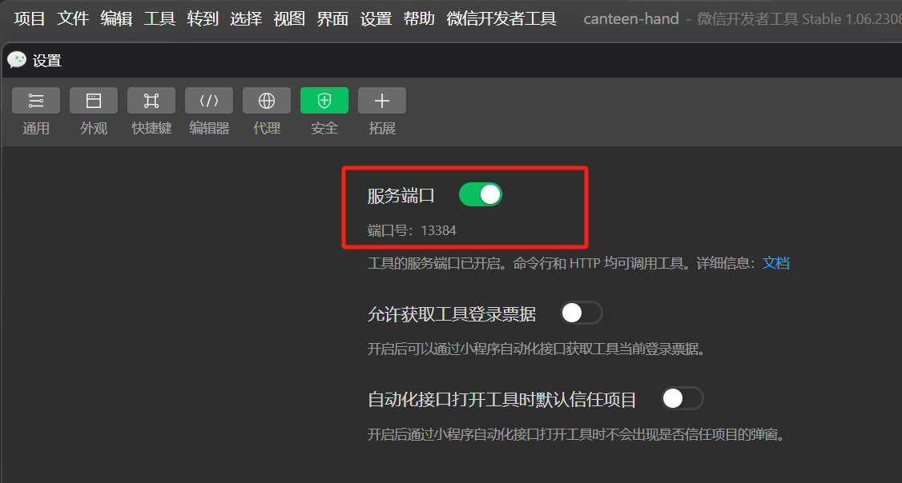

## 部署流程

#### 1. 安装[Node.js](https://nodejs.org/en)

#### 2. 安装[微信开发者工具](https://developers.weixin.qq.com/miniprogram/dev/devtools/download.html)，并打开设置，开启服务端口

#### 3. 安装[HBuilderX](https://www.dcloud.io/hbuilderx.html)

#### 4. 在HBuilderX中导入本项目

#### 5. 在项目所在目录中，使用`npm install @escook/request-miniprogram`网络请求相关库

#### 6. 运行到微信开发者工具

